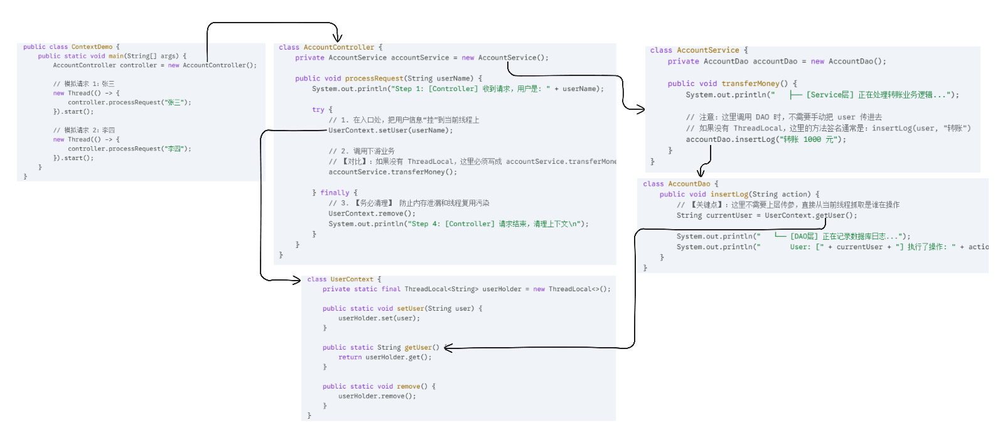

>## ThreadLocal

`ThreadLoacl`在Java中的核心作用是**提供线程内的局部变量**。它能让每个线程拥有该变量的一个独立副本，从而避免了多线程之间的竞争和干扰。
### 底层原理
#### 核心结构：数据存在哪里？
**`ThreadLocal` 本身并不存储数据**，它只是一个访问入口，真正存储数据的是 **`Thread` 线程对象本身**
- 每个 `Thread` 对象内部都有一个名为 `threadLocals` 的成员变量。
    
- 这个变量的类型是 `ThreadLocalMap`（它是 `ThreadLocal` 的静态内部类）。
    
- 当我们调用 `set()` 时，其实是把数据存到了**当前线程**的 `threadLocals` 那个 Map 里
#### 映射关系与冲突解决
在 `ThreadLocalMap` 中：
- **Key**：是当前的 `ThreadLocal` 对象实例。
    
- **Value**：是我们想要保存的业务数据。
值得注意的是，`ThreadLocalMap` 和我们常用的 `HashMap` 不同。它在解决 Hash 冲突时，没有使用链表法，而是采用了**线性探测法**。也就是说，如果计算出的槽位被占了，它会顺着数组往后找，直到找到一个空位为止。这也意味着 `ThreadLocalMap` 不适合存储大量数据。
#### 弱引用与内存泄漏
`ThreadLocalMap` 的 Entry 对 **Key（ThreadLocal 对象）使用的是弱引用**，但对 **Value 使用的是强引用**。
- **设计初衷**：如果外部对 `ThreadLocal` 对象的引用没了，GC 发生时，作为 Key 的 `ThreadLocal` 会被自动回收，变成 `null`，这样尽量避免 Key 的内存泄漏。
    
- **潜在风险**：虽然 Key 回收了，但只要线程还在运行（比如在线程池中），Value 依然有一条强引用链：`Thread -> ThreadLocalMap -> Entry -> Value`。
    
- **后果**：这会导致 `Entry` 中出现 `Key` 为 `null`，但 `Value` 还在的情况。这个 Value 既无法被访问（因为 Key 没了），也无法被 GC 回收，从而造成**内存泄漏**。

所以，我们在使用 `ThreadLocal` 时，标准范式是在 `try-finally` 代码块的 `finally` 中，**显式调用 `remove()` 方法**。这不仅是为了清理数据，更是为了切断 Value 的引用链，防止内存泄漏和线程复用导致的数据脏读。
### 应用场景
##### 保存线程上下文信息（代替参数传递）
通过 `ThreadLocal`，将用户信息存储在线程中，实现了层与层之间的**零侵入**数据共享。</br>
✨下面的代码模拟了一个 **Controller -> Service -> DAO** 的三层架构调用。请注意观察中间的 **Service 层**，它的方法参数里**完全没有**用户信息，实现了参数解耦。</br>
 **代码结构**
1. **`UserContext`**：基于 ThreadLocal 的上下文容器。
    
2. **`AccountDao` (底层)**：真正需要使用用户信息的地方。
    
3. **`AccountService` (中间层)**：业务逻辑层，**它不需要感知用户信息的传递**。
    
4. **`AccountController` (顶层)**：模拟接收请求，设置上下文。
```java
// ==========================================
// 1. 上下文容器 (工具类)
// ==========================================
class UserContext {
    private static final ThreadLocal<String> userHolder = new ThreadLocal<>();

    public static void setUser(String user) {
        userHolder.set(user);
    }

    public static String getUser() {
        return userHolder.get();
    }

    public static void remove() {
        userHolder.remove();
    }
}

// ==========================================
// 2. DAO 层 (最底层，需要用到用户信息)
// ==========================================
class AccountDao {
    public void insertLog(String action) {
        // 【关键点】：这里不需要上层传参，直接从当前线程抓取是谁在操作
        String currentUser = UserContext.getUser();
        
        System.out.println("   └── [DAO层] 正在记录数据库日志...");
        System.out.println("       User: [" + currentUser + "] 执行了操作: " + action);
    }
}

// ==========================================
// 3. Service 层 (中间层，无需透传参数)
// ==========================================
class AccountService {
    private AccountDao accountDao = new AccountDao();

    public void transferMoney() {
        System.out.println("   ├── [Service层] 正在处理转账业务逻辑...");
        
        // 注意：这里调用 DAO 时，不需要手动把 user 传进去
        // 如果没有 ThreadLocal，这里的方法签名通常是：insertLog(user, "转账")
        accountDao.insertLog("转账 1000 元");
    }
}

// ==========================================
// 4. Controller 层 (入口，负责设置和清理)
// ==========================================
class AccountController {
    private AccountService accountService = new AccountService();

    public void processRequest(String userName) {
        System.out.println("Step 1: [Controller] 收到请求，用户是: " + userName);

        try {
            // 1. 在入口处，把用户信息“挂”到当前线程上
            UserContext.setUser(userName);

            // 2. 调用下游业务
            // 【对比】：如果没有 ThreadLocal，这里必须写成 accountService.transferMoney(userName)
            accountService.transferMoney(); 

        } finally {
            // 3. 【务必清理】 防止内存泄漏和线程复用污染
            UserContext.remove();
            System.out.println("Step 4: [Controller] 请求结束，清理上下文\n");
        }
    }
}

// ==========================================
// 5. 测试主程序
// ==========================================
public class ContextDemo {
    public static void main(String[] args) {
        AccountController controller = new AccountController();

        // 模拟请求 1：张三
        new Thread(() -> {
            controller.processRequest("张三");
        }).start();

        // 模拟请求 2：李四
        new Thread(() -> {
            controller.processRequest("李四");
        }).start();
    }
}
```
